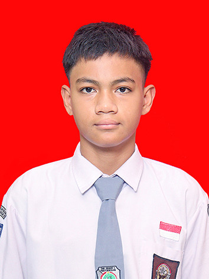

# Portfolio Personal Premium — Said Rifaa Anaqi

Website portfolio personal modern, minimalis, dan elegan yang dirancang khusus untuk deployment langsung di **GitHub Pages**. Dibuat dengan arsitektur 100% statis menggunakan teknologi web standar (**HTML5**, **CSS3**, dan **Vanilla JavaScript**) tanpa backend, tanpa database, dan tanpa proses *build* rumit.

---

## Fitur Utama

- **100% Static & GitHub Pages Ready**: Cukup unggah berkas ke repositori dan aktifkan GitHub Pages.
- **Dark Minimalist Aesthetic**: Palet warna gelap (*Charcoal* & *Black*) dengan aksen merah presisi (`#e53935`), whitespace proporsional, dan tipografi tegas (*Space Grotesk* & *Inter*).
- **Sticky & Frosted Glass Navbar**: Navigasi sticky transparan yang berubah menjadi gelap dengan *backdrop blur* saat digulir, dilengkapi *active link indicator* dan drawer menu mobile responsif.
- **Editorial About & Metrik**: Tata letak editorial rapi dengan angka statistik yang mudah diedit.
- **Pengelompokan Skills Modern**: Tersusun rapi dalam kategori *Development*, *Tools*, dan *Design* dengan indikator visual minimalis.
- **Interaktif Project Showcase & Modal Dialog**: Menampilkan 6 proyek contoh dengan hover zoom halus dan jendela modal detail proyek (dapat ditutup via tombol, klik di luar, atau tombol `Escape`).
- **Linimasa Perjalanan & Pendidikan**: Section *My Journey* dan *Education* yang terstruktur.
- **Form Kontak Tervalidasi**: Validasi input sisi klien dengan opsi default `mailto:` serta instruksi mudah untuk integrasi Formspree.
- **Mikro-Interaksi Halus**: Indikator progres scroll di bagian paling atas, tombol *Back to Top*, animasi *reveal on scroll* berbasis `IntersectionObserver`, dan *custom cursor* desktop.
- **Aksesibilitas & Performa**: Ramah pembaca layar (ARIA), navigasi keyboard lengkap (`:focus-visible`), dan mendukung `prefers-reduced-motion`.
- **Bebas Emoji**: Seluruh elemen visual menggunakan SVG inline yang bersih dan profesional.

---

## Struktur Berkas

```
/
├── index.html               # Struktur semantik website & data konten
├── style.css                # Sistem desain, variabel warna, responsivitas
├── script.js                # Logika interaktif Vanilla JavaScript
├── README.md                # Panduan instalasi dan kustomisasi ini
└── assets/
    ├── favicon.svg          # Favicon inisial SRA
    ├── profile.jpg          # Foto profil formal Said Rifaa Anaqi
    └── projects/            # Tangkapan layar proyek
        ├── project-1.jpg    # RPLCHAT
        ├── project-2.jpg    # CIWAWA
        ├── project-3.jpg    # KritSar ANDIPANI
        ├── project-4.jpg    # Jadwal Kelas
        ├── project-5.jpg    # Minecraft Launcher
        └── project-6.jpg    # Personal Portfolio
```

---

## Panduan Menjalankan Secara Lokal

Anda tidak memerlukan server Node.js atau Apache/PHP untuk menjalankan website ini.

1. Buka folder proyek ini di komputer Anda.
2. Klik ganda berkas `index.html` untuk langsung membukanya di browser favorit Anda (Google Chrome, Firefox, Microsoft Edge, Safari).
3. (Opsional) Jika menggunakan VS Code, Anda juga dapat menggunakan ekstensi **Live Server** dengan klik kanan pada `index.html` lalu pilih **Open with Live Server**.

---

## Panduan Deployment ke GitHub Pages

Ikuti langkah-langkah mudah berikut untuk mengunggah portfolio ini ke internet secara gratis menggunakan GitHub Pages:

### Langkah 1: Buat Repositori Baru di GitHub
1. Masuk ke akun [GitHub](https://github.com/).
2. Buat repositori baru dengan menekan tombol **New** (atau kunjungi `https://github.com/new`).
3. Beri nama repositori:
   - Jika ingin URL menjadi `https://Saidrifaaanaqi.github.io/`, beri nama repositori: `Saidrifaaanaqi.github.io`.
   - Atau beri nama repositori lain, misalnya: `portfolio`.
4. Pilih opsi **Public**.
5. Jangan centang "Initialize with README" jika Anda ingin mengunggah seluruh berkas lokal secara langsung.
6. Klik **Create repository**.

### Langkah 2: Unggah Berkas ke Repositori
Anda dapat mengunggah berkas melalui Git CLI di terminal:
```bash
# Inisialisasi git pada folder proyek
git init
git add .
git commit -m "Initial commit: Portfolio Said Rifaa Anaqi"
git branch -M main

# Hubungkan ke remote repositori GitHub Anda
git remote add origin https://github.com/Saidrifaaanaqi/portfolio.git

# Push ke GitHub
git push -u origin main
```
*Atau, Anda dapat mengunggah seluruh berkas dan folder `assets/` secara langsung melalui antarmuka web GitHub via fitur "uploading an existing file".*

### Langkah 3: Aktifkan GitHub Pages
1. Di halaman repositori GitHub Anda, buka menu **Settings** (tab kanan atas).
2. Di panel sebelah kiri, klik menu **Pages** (di bawah bagian *Code and automation*).
3. Pada opsi **Build and deployment**:
   - **Source**: Pilih `Deploy from a branch`.
   - **Branch**: Pilih cabang `main` (atau `master`) dan folder `/ (root)`.
4. Klik tombol **Save**.
5. Tunggu sekitar 1 hingga 2 menit. Halaman web Anda akan aktif di alamat:
   `https://Saidrifaaanaqi.github.io/portfolio/` (atau `https://Saidrifaaanaqi.github.io/`).

---

## Panduan Kustomisasi Konten

Seluruh data konten dapat diubah secara langsung pada berkas `index.html`. Berikut panduan cepatnya:

### 1. Mengganti Foto Profil Formal
- Siapkan foto formal Anda (disarankan berorientasi potret dengan rasio sekitar 4:5 atau 3:4).
- Beri nama berkas foto Anda: `profile.jpg`.
- Timpa berkas yang ada di folder: `assets/profile.jpg`.
- Jika nama atau format berkas berbeda (misalnya `.png`), perbarui baris berikut di `index.html`:
  ```html
  
  ```

### 2. Mengubah Data & Statistik Personal
Buka `index.html`, cari section dengan ID `about`:
- Ubah narasi bio pada elemen `<p class="lead-text">` dan paragraf berikutnya.
- Ubah angka statistik pada elemen `.metric-number`:
  ```html
  <span class="metric-number">10+</span>
  <span class="metric-label">Projects Built</span>
  ```

### 3. Mengubah Keahlian (Skills)
Cari section `id="skills"` di `index.html`. Anda dapat menambah atau mengurangi elemen `.skill-pill`:
```html
<div class="skill-pill">
  <span class="skill-indicator" aria-hidden="true"></span>
  <span class="skill-name">Nama Teknologi</span>
  <span class="skill-badge">Keterangan Singkat</span>
</div>
```

### 4. Mengganti atau Menambah Proyek
Cari section `id="projects"` di `index.html`. Setiap proyek dibungkus dalam tag `<article class="project-card">` dengan atribut data:
```html
<article class="project-card" 
  data-title="Nama Proyek"
  data-category="Kategori Proyek"
  data-status="Completed / Active"
  data-image="assets/projects/project-1.jpg"
  data-desc="Deskripsi lengkap yang akan tampil pada popup modal."
  data-features="Fitur 1; Fitur 2; Fitur 3"
  data-tech="HTML5, CSS3, JavaScript"
  data-demo="https://link-demo-anda.com"
  data-repo="https://github.com/username/project"
>
```
*Data ini otomatis digunakan untuk menampilkan kartu proyek dan membuka modal detail saat diklik.*

### 5. Mengubah Informasi Kontak & Tautan Sosial
Cari section `id="contact"` di `index.html`:
- Ganti alamat email pada tautan `mailto:saidrifaa@example.com`.
- Ganti tautan GitHub, Instagram, dan nomor WhatsApp pada list kontak (`.contact-list`).
- Perbarui juga tautan sosial pada bagian footer (`.footer-socials`).

### 6. Menghubungkan Form Kontak ke Formspree (Opsional)
Secara default, form menggunakan aksi `mailto:` yang membuka aplikasi email pengunjung. Jika Anda ingin pesan otomatis terkirim langsung ke email Anda tanpa membuka aplikasi email pengunjung:
1. Daftar gratis di [Formspree](https://formspree.io).
2. Buat formulir baru dan dapatkan endpoint Anda (misalnya `https://formspree.io/f/xyzabced`).
3. Pada tag `<form id="contact-form">` di `index.html`, ubah menjadi:
   ```html
   <form id="contact-form" class="contact-form" action="https://formspree.io/f/YOUR_ENDPOINT" method="POST">
   ```
4. Di berkas `script.js`, Anda dapat menonaktifkan baris `window.location.href = mailtoUrl;` dan membiarkan form mengirimkan data via `fetch` atau submit standar.

### 7. Mengubah Warna Dasar Aksen
Jika Anda ingin menyesuaikan nuansa warna merah, buka `style.css` pada baris paling atas di `:root`:
```css
:root {
  --accent: #e53935;         /* Warna aksen utama */
  --accent-dark: #b71c1c;    /* Varian gelap untuk hover */
  --accent-light: #ff6f60;   /* Varian terang untuk teks subtitel */
  ...
}
```

---

## Lisensi & Hak Cipta

© 2026 Said Rifaa Anaqi. Seluruh hak cipta dilindungi undang-undang.
Dipersilakan untuk dikembangkan dan disesuaikan untuk kebutuhan portfolio pribadi.
